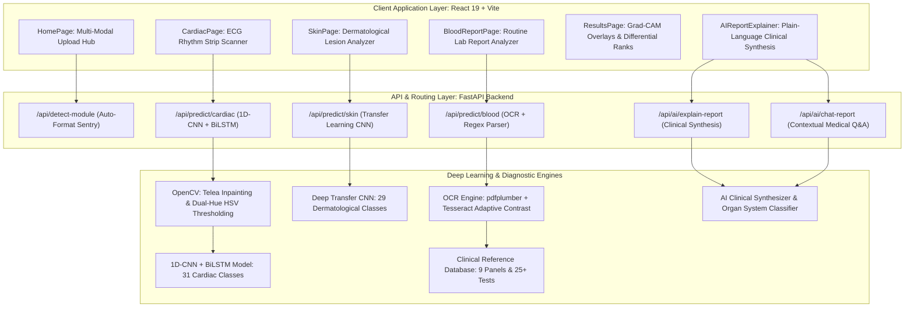

# 🏥 Spandan AI: Platform Features & Capabilities Master Guide
### Production Multi-Modal Health Diagnostic Platform & Clinical AI Assistant

---

### 1. Executive Platform Architecture

**Spandan AI** is a production-grade, multi-modal medical AI web application unifying three core diagnostic modalities under one cohesive health-monitoring platform, augmented by an interactive **Clinical AI Report Explainer**:



---

### 2. Feature Comparison Matrix

| Feature Domain | Module 1: Cardiac ECG | Module 2: Skin Lesion | Module 3: Blood Test Report | Module 4: AI Report Explainer |
| :--- | :--- | :--- | :--- | :--- |
| **Input Modality** | 12-lead paper rhythm strip scan/photo | Dermoscopic / camera lesion photograph | Multi-panel lab report scan (PNG/JPG) or digital PDF | Diagnostic result payload from any modality |
| **Diagnostic Scope** | **31 Cardiac Classes** across 5 groups | **29 Skin Classes** across 4 groups | **25+ Biomarkers** across 9 panels | Executive summaries across all 3 modules |
| **Core Algorithms** | Dual-Hue HSV suppression, Savitzky-Golay, 1D-CNN + BiLSTM | DullRazor hair inpainting, CIE-LAB CLAHE, Transfer CNN | Adaptive Otsu OCR, Regex parser, Pathological pattern correlation | Multi-system physiological mapping, heuristic synthesis |
| **Explainability** | **1D Grad-CAM** waveform activation heatmap | **2D Grad-CAM** jet colormap overlay ($\alpha=0.45$) | Visual range sliders with status pin indicators | Plain-language mechanism breakdown (*"Why this happens"*) |
| **Acuity & Triage** | Rare condition specialist flags (Brugada, WPW, VFib) | Malignancy alerts (Melanoma, Cellulitis) | Holistic Metabolic Score ($0-100$) & Doctor Consultation Trigger | Emergency red-flag sentry with immediate care guidance |
| **Interactivity** | Canvas signal chart with zoom & pan | Heatmap / Original image toggle | Panel filter tabs, test name search | Real-time chat assistant, prompt chips, Speech TTS |

---

### 3. Detailed Documentation Directory

For in-depth architectural and algorithmic specifications of each feature, refer to the dedicated feature specifications:

1. [🧠 **Clinical AI Report Explainer & Assistant Specification**](file:///d:/spandan/docs/FEATURE_AI_REPORT_EXPLAINER.md)
   - Plain-language executive overview engine
   - 6-domain organ physiological impact classifier (Hematology, Cardiovascular, Glycemic, Hepatic, Renal, Micronutrients)
   - Personalized dietary, physical movement, and habit prescriptions
   - Doctor consultation checklist & specialist referral routing
   - Interactive conversational Q&A assistant with Web Speech API text-to-speech
2. [🩸 **Blood Test Report Analysis Module Specification**](file:///d:/spandan/docs/FEATURE_BLOOD_REPORT_ANALYSIS.md)
   - Multi-format ingestion (scanned lab photos and digital PDFs)
   - Hybrid OCR extraction pipeline (`pdfplumber` + `pytesseract`)
   - Regex laboratory parsing engine with major lab chain aliases
   - Master clinical reference range database (CBC, Lipids, LFT, KFT, Glycemic, Thyroid, Electrolytes, Vitamins)
   - Multi-parameter pathological pattern correlation (Microcytic/Macrocytic Anemia, Type 2 Diabetes, Prediabetes, Dyslipidemia, Hepatic Strain)
   - Metabolic Health Score ($0-100$) algorithm
3. [🫀 **Cardiac ECG Prediction Module Specification**](file:///d:/spandan/docs/FEATURE_CARDIAC_ECG_PREDICTION.md)
   - OpenCV paper grid line removal (dual-hue HSV thresholding + Telea inpainting)
   - Continuous waveform trace isolation and digitization ($1000$ samples @ $250\text{ Hz}$)
   - Electrophysiological interval metrics (HR, RR, QT, PR, QRS, HRV SDNN, RMSSD)
   - 1D-CNN + Bi-directional LSTM deep hybrid network
   - 31 cardiac conditions across 5 clinical groups
   - 1D Grad-CAM waveform attribution overlays
4. [🔬 **Dermatological Skin Disease Prediction Module Specification**](file:///d:/spandan/docs/FEATURE_SKIN_DISEASE_PREDICTION.md)
   - DullRazor morphological hair and artifact removal
   - CIE-LAB CLAHE contrast enhancement across Fitzpatrick skin types
   - Automated lesion boundary segmentation & morphological ABCD analysis
   - Deep Transfer Learning CNN classifier across 29 dermatological conditions
   - 2D Grad-CAM transparent activation heatmap overlays ($\alpha = 0.45$)
5. [📘 **Model Training & Dataset Specification**](file:///d:/spandan/docs/MODEL_TRAINING_SPECIFICATION.md)
   - Patient-ID split strategies for MIT-BIH Arrhythmia & PTB-XL
   - ISIC / HAM10000 dermatological transfer learning & data augmentation
   - Class-weighting and focal loss formulations for rare conditions
6. [📐 **Full-Stack Architecture & Benchmarks**](file:///d:/spandan/docs/TRAINING_AND_ARCHITECTURE.md)
   - Robustness benchmarks against noise, lighting variance, and rotation
   - Docker containerization and production deployment specs

---

### 4. Automatic Multi-Modal Document Detection (`/api/detect-module`)

To streamline patient workflows, Spandan AI features an intelligent format classifier that automatically inspects uploaded files and routes them to the correct diagnostic module:

```
[Uploaded Document File]
           │
           ├──► Is PDF format or contains ".pdf"? ──► Module: BLOOD (Confidence 99%)
           │
           └──► Image Decoded (OpenCV BGR):
                  │
                  ├──► Aspect Ratio (W / H) > 1.7? ──► Module: CARDIAC (Confidence 94%)
                  │    (Wide horizontal rhythm strip standard)
                  │
                  ├──► Aspect Ratio < 0.88 AND Brightness > 200 AND Low Chromatic Disparity?
                  │    ──► Module: BLOOD (Confidence 95%)
                  │    (Portrait white paper with tabular printed text)
                  │
                  └──► Non-strip aspect ratio OR High Chrominance (R - B > 25)?
                       ──► Module: SKIN (Confidence 91%)
                       (Warm dermoscopic tones & circular lesions)
```

---

### 5. API Endpoint Inventory

| Endpoint | Method | Input Parameters | Output Payload | Description |
| :--- | :--- | :--- | :--- | :--- |
| `/` | `GET` | None | API metadata, online status, modalities list | Health and service discovery |
| `/api/health` | `GET` | None | Module loaded status, class counts | Microservice liveness & readiness check |
| `/api/detect-module` | `POST` | `file: UploadFile` | `detectedModule`, `confidence`, `reason` | Automated multi-modal document classifier |
| `/api/predict/cardiac` | `POST` | `file: UploadFile` | `predictions`, `metrics`, `ecgSignal`, `heatmapUrl`, `aiExplanation` | Complete cardiac digitization & 1D Grad-CAM |
| `/api/predict/skin` | `POST` | `file: UploadFile` | `predictions`, `segmentationMetrics`, `heatmapUrl`, `aiExplanation` | Dermatological CNN & 2D Grad-CAM |
| `/api/predict/blood` | `POST` | `file: UploadFile`, `manual_data: str` | `parameters`, `conditions`, `summary`, `aiExplanation` | Lab OCR, reference ranges & pathological patterns |
| `/api/blood/reference-ranges` | `GET` | None | `panels`, `referenceRanges` | Master adult clinical reference database |
| `/api/ai/explain-report` | `POST` | `reportData: dict`, `module: str`, `readingLevel: str` | `explanation: dict` | Deep clinical synthesis & organ breakdown |
| `/api/ai/chat-report` | `POST` | `reportData: dict`, `message: str`, `chatHistory: list` | `reply: str`, `followUpSuggestions: list` | Context-aware interactive medical Q&A assistant |

---

### 6. Design System & Frontend Architecture

The user interface is engineered according to modern medical web design standards:
- **Design Aesthetic**: Glassmorphic dark mode (`--bg-primary: #0a0e1a`) with HSL color-coded modality accents:
  - *Cardiac Accent*: Rose (`#f43f5e`) & Purple (`#8b5cf6`)
  - *Skin Accent*: Emerald Cyan (`#06d6a0`) & Blue (`#3b82f6`)
  - *Blood Accent*: Amber (`#f59e0b`) & Crimson (`#ef4444`)
- **Accessibility & Interaction**:
  - Voice narration with real-time animated equalizer wave bars.
  - Interactive Canvas waveform rendering with millivolt grid lines.
  - Touch-friendly prompt chips and mobile-responsive collapsible panels.
  - Printable report layouts formatted for primary care consultations.
- **Fail-Safe Offline Simulation**: The application includes comprehensive client-side synthetic fallbacks for all four modules, guaranteeing full demonstration capability even when disconnected from the backend.

---

### 7. Verification & Compliance
- **Automated Integration Tests**: 9/9 tests passing in `backend/tests/test_api.py`.
- **Statutory Medical Disclaimer**: Stamped across all UI results and API responses:
  > *Spandan AI is intended exclusively for educational, research, and decision-support purposes. It is not a certified diagnostic device and cannot substitute for professional medical evaluation by a licensed healthcare provider.*
