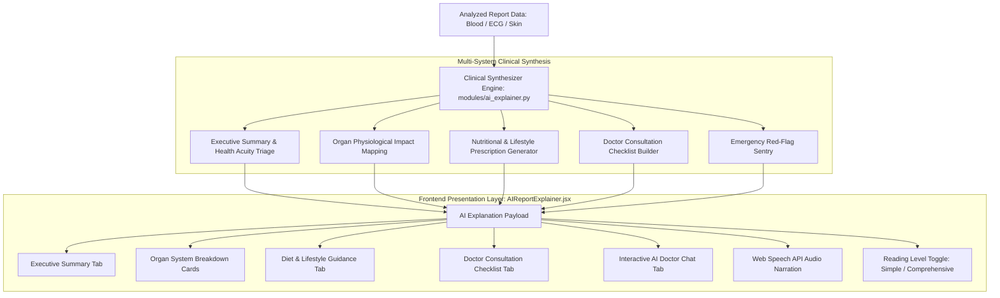

# 🧠 Spandan AI: Clinical Report Explainer & Conversational Assistant
## Technical Specification, Clinical Knowledge Engine & Interaction Architecture

---

### 1. Feature Overview & Purpose

Medical laboratory reports (CBC, lipid profiles, metabolic panels, liver/kidney functions) and electrophysiological/dermatological readouts are frequently opaque and intimidating to non-specialists. Raw numbers like *MCV 74 fL*, *ALT 64 U/L*, or *LDL 142 mg/dL* lack clinical context for patients, often causing unnecessary alarm or, conversely, complacency regarding actionable metabolic risks.

The **Spandan Clinical AI Report Explainer** is an intelligent medical synthesis and conversational decision-support engine that bridges raw diagnostic outputs and patient understanding. It automatically:
1. **Synthesizes Executive Plain-Language Summaries**: Translates lab markers and neural network predictions into clear, reassuring, and scientifically rigorous explanations.
2. **Classifies Organ Systems Impact**: Maps disparate test parameters to 6 biological domains (Hematology, Cardiovascular, Glycemic, Hepatic, Renal, Micronutrients & Immune) with physiological mechanisms.
3. **Generates Actionable Lifestyle & Nutritional Prescriptions**: Formulates concrete dietary adjustments, safe physical activity guidelines, daily hydration targets, and clinician-approved supplement inquiries.
4. **Builds a Doctor Consultation Checklist**: Prepares patients with high-yield clinical questions and specialist referral routing.
5. **Flags Red-Flag Emergencies**: Distinguishes acute life-threatening symptoms from chronic, outpatient-manageable lab variances.
6. **Enables Interactive Conversational Q&A**: An interactive chat assistant with contextual awareness of the patient's exact numbers, follow-up prompt chips, and Web Speech API Text-to-Speech (TTS) narration.



---

### 2. Clinical Knowledge Architecture

The explainer operates on a deterministic, evidence-based clinical reasoning pipeline with optional plug-and-play LLM expansion (via `GEMINI_API_KEY` or `OPENAI_API_KEY`):

#### 2.1 Multi-System Organ Impact Classifier

The engine groups evaluated laboratory parameters into physiological domains:

| Organ System Domain | Associated Biomarkers | Evaluated Pathophysiology | Clinical Status Trigger |
| :--- | :--- | :--- | :--- |
| **Blood & Oxygenation (Hematology)** | Hemoglobin, RBC, Hematocrit, MCV, Platelets, Ferritin, Serum Iron | Red cell volume, marrow output, systemic cellular oxygen delivery | $\text{Hb} < 12.0\text{ g/dL}$ or $\text{MCV} < 80\text{ fL}$ |
| **Cardiovascular & Lipid Transport** | Total Cholesterol, LDL, HDL, Triglycerides, VLDL | Atherogenic lipoprotein particle density, vascular endothelial plaque risk | $\text{LDL} \ge 130\text{ mg/dL}$, $\text{TG} \ge 150\text{ mg/dL}$, or $\text{HDL} < 40\text{ mg/dL}$ |
| **Metabolic & Glycemic Balance** | Fasting Blood Glucose, HbA1c, Postprandial Glucose | Baseline insulin sensitivity, pancreatic beta-cell strain, 3-month glycation | $\text{FBS} \ge 100\text{ mg/dL}$ or $\text{HbA1c} \ge 5.7\%$ |
| **Hepatic & Metabolic Detoxification** | ALT (SGPT), AST (SGOT), Total Bilirubin, ALP, Albumin | Hepatocellular membrane integrity, biliary excretion, non-alcoholic fatty liver (NAFLD) | $\text{ALT} > 56\text{ U/L}$ or $\text{AST} > 40\text{ U/L}$ |
| **Renal Clearance & Fluid Balance** | Creatinine, BUN, eGFR, Uric Acid, Sodium, Potassium | Glomerular filtration rate, nitrogenous waste elimination, cardiac resting membrane potential | $\text{Creatinine} > 1.2\text{ mg/dL}$, $\text{K} > 5.0\text{ mEq/L}$, or $\text{eGFR} < 60$ |
| **Micronutrients & Immune Resilience** | Vitamin D (25-OH), Vitamin B12, WBC Count, CRP, ESR | Genomic transcription, myelin synthesis, acute-phase systemic inflammation | $\text{Vit D} < 30\text{ ng/mL}$, $\text{CRP} > 3.0\text{ mg/L}$, or $\text{WBC} > 11,000$ |

#### 2.2 Physiological Mechanism Explanations ("Why This Happens")
Rather than simply stating a number is high or low, each organ card includes a biological mechanism snippet:
- **Hematology**: *"Hemoglobin acts as molecular transport vehicles inside red blood cells. When hemoglobin or cell volume (MCV) declines, peripheral tissues receive less oxygen, prompting compensatory cardiac effort."*
- **Cardiovascular**: *"Low-density lipoproteins (LDL) deposit excess cholesterol into arterial linings, while High-density lipoproteins (HDL) retrieve cholesterol for hepatic clearance."*
- **Hepatic**: *"ALT and AST are intracellular enzymes residing inside hepatocytes. When liver cells experience metabolic strain or inflammation, these enzymes seep into systemic circulation."*

---

### 3. Lifestyle & Nutritional Prescription Engine

The prescription engine translates multi-parameter abnormalities into targeted, actionable daily habits:

```
               [Evaluated Report Abnormalities]
                             │
     ┌───────────────────────┼───────────────────────┐
     ▼                       ▼                       ▼
Low Hemoglobin / MCV    High LDL / Triglycerides  High Glucose / HbA1c
  - Plant iron + Vit C    - Soluble fiber (oats)    - Low-glycemic pairing
  - Separate tea/coffee   - Swap butter for olive oil - Post-meal 15-min walk
  - Discuss ferritin test - 150m/wk aerobic cardio  - 7-8h restful sleep
```

1. **Targeted Nutrition**:
   - *Iron & Hemoglobin*: Enhances non-heme iron absorption by pairing lentils, spinach, and pumpkin seeds with citric acid (Vitamin C); restricts dietary tannins (tea, coffee) around meal times.
   - *Atherogenic Lipids*: Prescribes viscous soluble fiber (oats, chia seeds, legumes) to bind intestinal bile acids; substitutes saturated/trans-fats with monounsaturated extra virgin olive oil.
   - *Glycemic Control*: Recommends the "Plate Method" (50% non-starchy vegetables, 25% lean protein, 25% complex whole grains) to prevent insulin spikes.
2. **Physical Activity**:
   - Prescribes 150 minutes of weekly moderate aerobic exercise (brisk walking, cycling) to elevate cardioprotective HDL.
   - Suggests light 10–15 minute postprandial walks to activate non-insulin dependent GLUT4 glucose translocation into working skeletal muscles.
3. **Physician-Guided Supplementation**:
   - Identifies evidence-based questions for clinicians regarding Cholecalciferol (Vitamin D3), Methylcobalamin (B12), Elemental Iron, and Omega-3 fatty acids (EPA/DHA).

---

### 4. Interactive "Ask AI Doctor" Conversational Assistant

Patients frequently have urgent, specific questions upon receiving their report. The explainer incorporates a context-aware conversational agent with natural language intent recognition:

#### 4.1 Supported Natural Language Intents

1. **"Explain Like I'm 10" / Simple English**:
   - *User*: *"Can you explain this report like I'm a kid?"*
   - *AI*: Uses intuitive automotive/delivery truck metaphors (red blood cells as delivery trucks, liver/kidneys as filters) to clarify lab deviations without frightening the user.
2. **Dietary & Meal Planning**:
   - *User*: *"What should I eat for breakfast this week based on these numbers?"*
   - *AI*: Provides concrete meal options targeting the patient's specific abnormal markers.
3. **Emergency & Acuity Triage**:
   - *User*: *"Is this dangerous? Should I go to the hospital?"*
   - *AI*: Evaluates whether critical emergency thresholds are breached; reassures the patient when findings are chronic/outpatient, while providing strict red-flag emergency symptoms (chest pain, syncope, dark stools) that necessitate urgent care.
4. **Doctor Consultation Prep**:
   - *User*: *"What should I ask my doctor about these results?"*
   - *AI*: Delivers a numbered list of high-yield questions referencing their exact values.
5. **Biomarker Deep-Dives**:
   - *User*: *"Tell me about my MCV"* or *"Why is my ALT high?"*
   - *AI*: Retrieves the measured value, units, standard adult reference interval, biological role, and optimization guidance.

---

### 5. Frontend UI/UX Architecture (`AIReportExplainer.jsx`)

#### 5.1 Component Structure
- **Glow Header**: Displays the Spandan Clinical AI badge with pulsating indicator, reading-level switch, speech button, and clipboard export.
- **Dynamic Headline Banner**: Shows the primary clinical finding, acuity badge (*High Priority*, *Moderate*, *Optimal*), health score ($0-100$), and analysis timestamp.
- **Tab Navigation Bar**:
  - `Executive Summary`: Overview, positive findings, primary focus areas, and red-flag alerts.
  - `Organ Breakdown`: Grid of interactive physiological organ cards with colored status edges.
  - `Diet & Lifestyle`: Category cards for Nutrition, Movement, Supplements, and Habits.
  - `Doctor Checklist`: Numbered consultation questions, recommended specialists, and follow-up timeline.
  - `Ask AI Doctor`: Interactive chat stream with prompt chips, typing animations, and contextual follow-up pills.

#### 5.2 Speech Synthesis (TTS) Integration
- Employs browser-native `window.speechSynthesis` with utterance rate calibration ($0.95\times$) for natural clinician-style pacing.
- Renders animated CSS 3-bar equalizer waves (`.equalizer-waves`) when audio playback is active.
- Includes automatic cleanup and cancellation on component unmount or tab changes.

---

### 6. API Endpoints

#### `POST /api/ai/explain-report`
Generates or regenerates an AI explanation object for an analyzed diagnostic report.

- **Request Body**:
  ```json
  {
    "reportData": {
      "parameters": [...],
      "conditions": [...],
      "summary": { "healthScore": 68, "abnormalCount": 2 }
    },
    "module": "blood",
    "readingLevel": "standard"
  }
  ```
- **Response Body**:
  ```json
  {
    "explanation": {
      "headline": "Actionable Metabolic & Lifestyle Findings Identified (2 Tests Flagged)",
      "healthScore": 68,
      "acuityLevel": "Moderate",
      "executiveSummary": "...",
      "organSystems": [...],
      "lifestylePrescription": {...},
      "doctorChecklist": {...},
      "redFlags": [...],
      "generatedAt": "2026-10-01 22:18:20"
    },
    "disclaimer": "This tool is for educational and decision-support purposes only..."
  }
  ```

#### `POST /api/ai/chat-report`
Interactively answers user questions with context of their analyzed diagnostic report.

- **Request Body**:
  ```json
  {
    "reportData": {...},
    "message": "What foods should I eat to raise hemoglobin and lower LDL?",
    "chatHistory": [...],
    "module": "blood"
  }
  ```
- **Response Body**:
  ```json
  {
    "reply": "Here is your personalized nutrition roadmap based specifically on your analyzed test numbers...",
    "followUpSuggestions": [
      "What supplements might I need?",
      "Can you suggest a sample daily meal plan?",
      "When should I re-test my blood?"
    ],
    "disclaimer": "This tool is for educational and decision-support purposes only..."
  }
  ```

---

### 7. Medical Safety & Compliance Guardrails
1. **Mandatory Disclaimer Display**: Every AI explanation and chat response explicitly maintains that Spandan AI is an educational decision-support tool, not a certified diagnostic device.
2. **Emergency Triage Filter**: Immediate symptom red-flags (crushing chest pain, severe dyspnea, syncope) are prominently surfaced to prevent patients with acute emergencies from delaying urgent medical care.
3. **No Unsupervised Medication Adjustment**: The AI does not prescribe pharmaceutical dosages or advise discontinuing physician-prescribed medications; it prompts patients to consult their licensed doctor.
