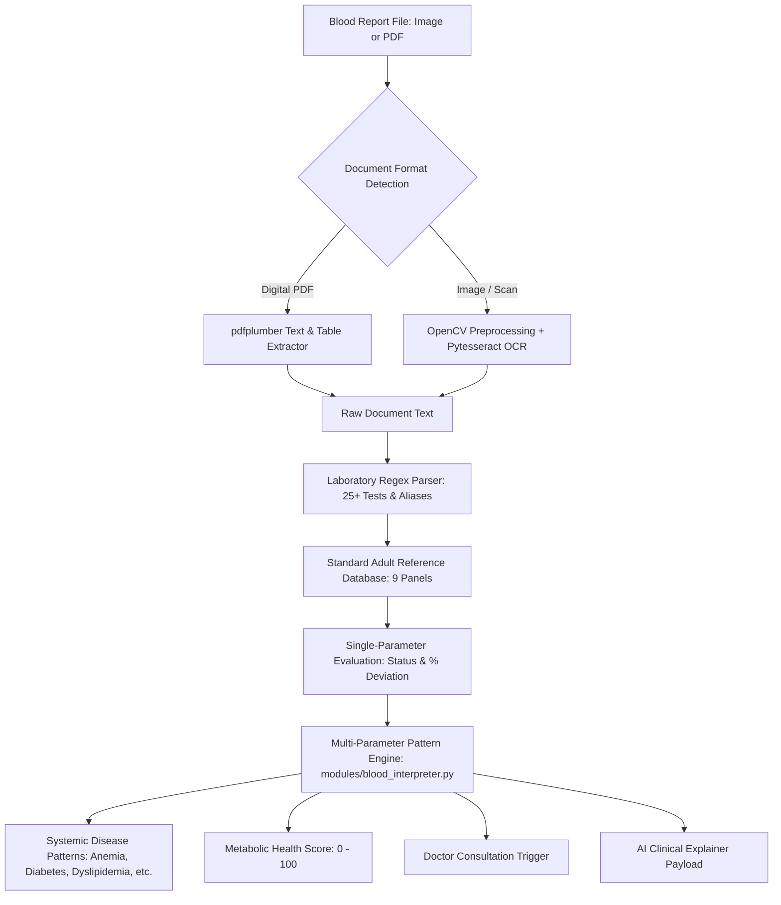

# 🩸 Spandan AI: Blood Test Report Analysis Module
## Multi-Format Lab Ingestion, Clinical Reference Ranges & Pathological Pattern Engine

---

### 1. Overview & Diagnostic Purpose

Routine blood tests (CBC, Lipid Profile, Metabolic Panels, LFT, KFT, Thyroid, Electrolytes, Vitamins) are the most widely performed diagnostic investigations in modern medicine. However, laboratory reports are distributed across incompatible layouts (tabular PDFs, scanned paper, mobile photos) with disparate parameter nomenclatures and reference conventions.

The **Blood Test Report Analysis Module** automates end-to-end laboratory document processing:
1. **Multi-Format Ingestion**: Ingests both digital PDFs and mobile camera photographs / paper scans.
2. **Hybrid OCR & Document Extraction**: Combines `pdfplumber` for vector-embedded digital PDFs with an `OpenCV` + `pytesseract` pipeline for photographic scans.
3. **Multi-Layout Laboratory Parsing**: Identifies test names, numerical values, and units using robust regular expression patterns supporting major lab chains (Thyrocare, Dr Lal PathLabs, Quest Diagnostics, Labcorp, SRL).
4. **Standard Adult Reference Benchmarking**: Benchmarks parameters against a master clinical database of adult reference intervals across 9 panels and 25+ parameters.
5. **Multi-Parameter Correlated Pattern Recognition**: Identifies systemic pathological patterns that single-test evaluations miss (e.g. Microcytic Anemia, Type 2 Diabetes, Atherogenic Dyslipidemia, Hepato-Metabolic Strain, Renal Impairment).
6. **Holistic Metabolic Health Scoring**: Quantifies overall physiological equilibrium onto a unified score ($0 - 100$).



---

### 2. Document Ingestion & Optical Character Recognition (OCR)

#### 2.1 PDF Parsing (`pdfplumber`)
For digital PDF reports generated by clinical diagnostic laboratories:
- Extracts structural paragraph text.
- Extracts tabular grid rows (`page.extract_tables()`), joining cell items with pipe delimiters (`|`) to maintain row associations between test names and observed values.

#### 2.2 Photographic & Scanned Image Pipeline (`OpenCV` + `pytesseract`)
When patients photograph paper lab reports using mobile devices, uneven lighting, shadows, and camera noise often degrade standard OCR accuracy:
1. **Grayscale Conversion**: Eliminates color chromatic aberration.
2. **Non-Local Means Denoising**: Removes sensor noise while preserving text edge contrast:
   ```python
   denoised = cv2.fastNlMeansDenoising(gray, h=10)
   ```
3. **Gaussian Adaptive Thresholding**: Compares pixel luminance to a $15 \times 15$ local neighborhood, resolving lighting falloff and shadows:
   ```python
   thresh = cv2.adaptiveThreshold(
       denoised, 255, cv2.ADAPTIVE_THRESH_GAUSSIAN_C, cv2.THRESH_BINARY, 15, 8
   )
   ```
4. **Tesseract Extraction**: Runs `pytesseract` with Page Segmentation Mode 6 (`--psm 6`), optimized for uniform blocks of tabular text.

---

### 3. Laboratory Parameter Extraction & Regex Engine

Laboratory reports employ varied abbreviations across hospital laboratory information systems (LIS). Spandan AI maintains a canonical mapping database with extensive aliases:

```
Canonical Name       Aliases Recognized
───────────────────────────────────────────────────────────────────────────
Hemoglobin           Hb, HGB, Haemoglobin, Blood Hemoglobin
RBC Count            Red Blood Cells, Total RBC, Erythrocyte Count
Hematocrit (HCT)     Hct, Packed Cell Volume, PCV
MCV                  Mean Corpuscular Volume
Platelet Count       PLT, Total Platelets, Thrombocyte Count
WBC Count            Total Leucocyte Count, TLC, White Blood Cells
Total Cholesterol    Cholesterol Total, Serum Cholesterol
LDL Cholesterol      LDL, Low Density Lipoprotein, Bad Cholesterol
HDL Cholesterol      HDL, High Density Lipoprotein, Good Cholesterol
Triglycerides        TG, Triglyceride, Serum Triglycerides
Fasting Blood Sugar  Fasting Blood Glucose, FBS, Glucose Fasting
HbA1c                Glycated Hemoglobin, Glycosylated Hemoglobin
ALT (SGPT)           SGPT, Alanine Aminotransferase, Serum GPT
AST (SGOT)           SGOT, Aspartate Aminotransferase, Serum GOT
Total Bilirubin      Bilirubin Total, T. Bilirubin
Creatinine           Serum Creatinine, Blood Creatinine
TSH                  Thyroid Stimulating Hormone, Ultra TSH
Vitamin D (25-OH)    25-Hydroxy Vitamin D, Vit D3, 25-OH Cholecalciferol
Vitamin B12          Cobalamin, Cyanocobalamin, Serum B12
C-Reactive Protein   CRP, High Sensitivity CRP, hs-CRP
```

#### Regex Extraction Strategy
The engine utilizes dual pattern heuristics to isolate numerical readings regardless of lab formatting:
- **Pattern 1 (Inline Name-Value pairs)**:
  `(?i)\b{alias}\b\s*[:=\-–]?\s*([0-9]+(?:\.[0-9]+)?)`
- **Pattern 2 (Tabular multi-column layouts)**:
  `(?i)\b{alias}\b[\s\|]+([0-9]+(?:\.[0-9]+)?)`

---

### 4. Master Clinical Reference Range Database (`REFERENCE_RANGES`)

Spandan benchmarks evaluated values against standardized adult reference intervals established by clinical pathology guidelines:

| Panel | Canonical Test | Normal Reference Range | Critical Low | Critical High | Standard Units |
| :--- | :--- | :--- | :--- | :--- | :--- |
| **CBC** | Hemoglobin | $13.5 - 17.5$ (M) / $12.0 - 15.5$ (F) | $< 7.0$ | $> 20.0$ | g/dL |
| **CBC** | RBC Count | $4.5 - 5.9$ | $< 3.0$ | $> 6.5$ | $\text{M}/\mu\text{L}$ |
| **CBC** | Hematocrit (HCT) | $41.0 - 50.0$ | $< 21.0$ | $> 60.0$ | % |
| **CBC** | MCV | $80.0 - 100.0$ | $< 65.0$ | $> 115.0$ | fL |
| **CBC** | Platelet Count | $150,000 - 450,000$ | $< 50,000$ | $> 1,000,000$ | $/ \mu\text{L}$ |
| **CBC** | WBC Count | $4,000 - 11,000$ | $< 2,000$ | $> 30,000$ | $/ \mu\text{L}$ |
| **Lipids** | Total Cholesterol | $125 - 200$ | — | $> 300$ | mg/dL |
| **Lipids** | LDL Cholesterol | $0 - 100$ | — | $> 190$ | mg/dL |
| **Lipids** | HDL Cholesterol | $40 - 60$ | $< 25$ | — | mg/dL |
| **Lipids** | Triglycerides | $0 - 150$ | — | $> 500$ | mg/dL |
| **Glycemic**| Fasting Blood Glucose | $70 - 99$ | $< 50$ | $> 300$ | mg/dL |
| **Glycemic**| HbA1c | $4.0 - 5.6$ | — | $> 10.0$ | % |
| **LFT** | ALT (SGPT) | $7 - 56$ | — | $> 300$ | U/L |
| **LFT** | AST (SGOT) | $10 - 40$ | — | $> 250$ | U/L |
| **LFT** | Total Bilirubin | $0.2 - 1.2$ | — | $> 5.0$ | mg/dL |
| **KFT** | Creatinine | $0.7 - 1.3$ | — | $> 4.0$ | mg/dL |
| **KFT** | Blood Urea Nitrogen | $7 - 20$ | — | $> 60$ | mg/dL |
| **Thyroid**| TSH | $0.4 - 4.0$ | $< 0.1$ | $> 20.0$ | mIU/L |
| **Vitamins**| Vitamin D (25-OH) | $30.0 - 100.0$ | $< 10.0$ | — | ng/mL |
| **Vitamins**| Vitamin B12 | $200 - 900$ | $< 100$ | — | pg/mL |
| **Immune** | C-Reactive Protein | $0 - 3.0$ | — | $> 50.0$ | mg/L |

---

### 5. Multi-Parameter Correlated Pathological Pattern Engine

Isolated lab values rarely tell the complete clinical story. Spandan AI's `analyze_blood_patterns` engine cross-references multi-organ parameters to detect complex pathological conditions:

#### 1. Hematological Anemia Differential Patterns
- **Iron Deficiency Microcytic Anemia**:
  $$\text{Hemoglobin} < 12.0\text{ g/dL} \quad \text{AND} \quad (\text{MCV} < 80\text{ fL} \lor \text{Ferritin} < 20\text{ ng/mL})$$
- **Macrocytic Anemia (B12 / Folate Deficiency)**:
  $$\text{Hemoglobin} < 12.0\text{ g/dL} \quad \text{AND} \quad \text{MCV} > 100\text{ fL}$$
- **Normocytic Anemia**:
  $$\text{Hemoglobin} < 12.0\text{ g/dL} \quad \text{AND} \quad 80 \le \text{MCV} \le 100\text{ fL}$$

#### 2. Glycemic / Diabetes Progression Patterns
- **Type 2 Diabetes Mellitus**:
  $$\text{Fasting Glucose} \ge 126\text{ mg/dL} \quad \lor \quad \text{HbA1c} \ge 6.5\% \quad \lor \quad \text{Postprandial} \ge 200\text{ mg/dL}$$
- **Prediabetes / Impaired Fasting Glucose**:
  $$100 \le \text{Fasting Glucose} \le 125\text{ mg/dL} \quad \lor \quad 5.7\% \le \text{HbA1c} \le 6.4\%$$

#### 3. Dyslipidemia & Atherogenic Risk Patterns
- Evaluates composite atherogenic burden:
  $$\text{Elevated LDL } (\ge 130) \lor \text{High Total Cholesterol } (\ge 200) \lor \text{Hypertriglyceridemia } (\ge 150) \lor \text{Low HDL } (< 40)$$

#### 4. Hepatic Cellular Injury (Transaminitis)
- Evaluates transaminase leakage from hepatocytes:
  $$\text{ALT} > 56\text{ U/L} \quad \lor \quad \text{AST} > 40\text{ U/L} \quad \lor \quad \text{Bilirubin} > 1.2\text{ mg/dL}$$
  Classifies acuity as *High Severity* if $\text{ALT} > 150\text{ U/L}$ or $\text{AST} > 120\text{ U/L}$.

#### 5. Renal Impairment & Glomerular Strain
- Detects compromised nitrogenous waste clearance:
  $$\text{Creatinine} > 1.2\text{ mg/dL} \quad \lor \quad \text{BUN} > 20\text{ mg/dL} \quad \lor \quad \text{eGFR} < 60\text{ mL/min}$$

#### 6. Systemic Immune Activation & Inflammatory Response
- Correlates acute-phase reactants with cellular defense:
  $$\text{CRP} > 3.0\text{ mg/L} \quad \text{AND/OR} \quad \text{WBC} > 11,000/\mu\text{L} \quad \text{AND/OR} \quad \text{ESR} > 20\text{ mm/hr}$$

---

### 6. Holistic Metabolic Health Score Algorithm

The engine computes an aggregated Health Stability Index ($S \in [20, 100]$):

$$R_{\text{abnormal}} = \frac{N_{\text{abnormal}}}{N_{\text{total}}}, \quad R_{\text{critical}} = \frac{N_{\text{critical}}}{N_{\text{total}}}$$

$$\text{Deduction} = (R_{\text{abnormal}} \times 45.0) + (R_{\text{critical}} \times 40.0)$$

$$\text{Health Score} = \max(20, \text{round}(100.0 - \text{Deduction}))$$

| Score Tier | Classification | Clinical Interpretation | Action Required |
| :--- | :--- | :--- | :--- |
| **$85 - 100$** | `OPTIMAL` | Biomarkers within healthy reference bounds | Routine preventive checkups |
| **$75 - 84$** | `MILD_VARIANCE` | Isolated minor parameter deviations | Nutritional & lifestyle tuning |
| **$50 - 74$** | `MODERATE_RISK` | Multi-system correlated abnormalities | Outpatient physician consultation |
| **$< 50$ or Critical $> 0$** | `CRITICAL_ATTENTION` | Severe physiological deviation | Prompt clinical evaluation |

---

### 7. Interactive Frontend Dashboard (`BloodResultsView.jsx`)

1. **Top KPI Scorecard**: Displays Metabolic Health Score, Flagged Abnormalities count, Normal Parameters count, and Critical Alert count.
2. **Doctor Consultation Banner**: Prominently alerts the patient when 2+ abnormalities or critical markers occur.
3. **Spandan AI Report Explainer**: Integrates the full multi-system AI explanation, dietary prescription, doctor checklist, and interactive chat.
4. **Visual Range Indicators**:
   - Each parameter renders a continuous range bar where the **Normal Reference Zone** is centered between $25\%$ and $75\%$ track width.
   - The observed patient value is mapped dynamically:
     $$\text{Position} = 25\% + \left(\frac{\text{Value} - \text{Min}}{\text{Max} - \text{Min}}\right) \times 50\%$$
   - Color-coded pins indicate status: *Normal* (cyan), *Low* (amber), *High* (amber), and *Critical* (rose).
5. **Panel Filter Tabs & Instant Search**: Filter parameters by panel (*CBC*, *Lipid Profile*, *LFT*, *KFT*, *Thyroid*, *Vitamins*, *Inflammation*) or search test names in real time.
6. **Print & Export**: Built-in `window.print()` layout styling formatted for clinical consultations.
