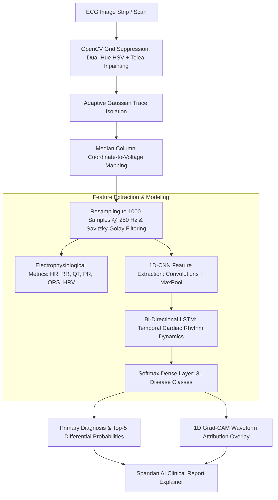

# 🫀 Spandan AI: Cardiac ECG Prediction Module
## Signal Digitization, 1D-CNN + BiLSTM Hybrid Architecture & 1D Grad-CAM Attribution

---

### 1. Feature Overview & Clinical Significance

The 12-lead Electrocardiogram (ECG) is the foundational diagnostic tool for assessing cardiac electrophysiology, rhythm anomalies, conduction blockades, and acute coronary syndromes. However, paper-based rhythm strips suffer from variable scan contrast, paper grid line interference, and physical wear.

The **Cardiac ECG Prediction Module** provides an end-to-end electrophysiological pipeline:
1. **Paper Grid Removal**: Automatically eliminates colored calibrated grid lines (pink, red, or gray) using `OpenCV` dual-hue HSV thresholding and Telea morphological inpainting.
2. **Signal Digitization**: Isolates the continuous ink trace and converts image coordinates into a calibrated numerical time-series signal ($1000$ samples at $250\text{ Hz}$).
3. **Electrophysiological Feature Extraction**: Detects R-peaks and computes clinical intervals (Heart Rate, RR Interval, QT Interval, HRV SDNN, PR Interval, QRS Duration, RMSSD).
4. **Hierarchical 31-Class Diagnostic Engine**: Evaluates conditions across 5 pathophysiological groups using a **1D-CNN + BiLSTM Hybrid Network**.
5. **Class Tiering & Specialist Flags**: Differentiates Core Tier conditions from Extended Tier and rare classes requiring confirmatory specialist review (e.g. Brugada Syndrome, WPW, 3rd-Degree Block).
6. **1D Grad-CAM Explainability**: Visualizes time-domain attribution weights directly overlaid onto the waveform to show which specific wave segments (P-wave, QRS complex, ST segment, T-wave) triggered the prediction.
7. **Integrated Clinical AI Explanation**: Synthesizes a patient-friendly electrophysiological summary with dietary, lifestyle, and doctor discussion guides.



---

### 2. Signal Preprocessing & Paper Grid Removal Pipeline

Standard clinical rhythm strips are printed on millimeter grid paper ($1\text{ mm} \times 1\text{ mm}$ small squares, $5\text{ mm} \times 5\text{ mm}$ heavy squares). Unprocessed grid pixels corrupt convolution filters and generate high-frequency synthetic noise:

#### 2.1 Dual-Hue HSV Thresholding
1. Converts the BGR input image into HSV color space.
2. Isolates red and pink grid lines using circular hue threshold masks:
   $$\text{Mask}_{\text{grid}} = (\text{Hue} \le 15^\circ \lor \text{Hue} \ge 165^\circ) \land (\text{Sat} \ge 40) \land (\text{Val} \ge 60)$$
3. Applies **Telea morphological inpainting** ($\text{radius}=3$) to replace grid lines with surrounding paper background values.

#### 2.2 Trace Isolation & Adaptive Thresholding
To isolate the thin, dark ECG ink trace under uneven illumination:
1. Converts the inpainted image to grayscale.
2. Applies Gaussian Adaptive Thresholding ($\text{blockSize}=21, C=10$):
   $$T(x, y) = \text{mean}_{\text{local}}(x, y) - C$$
3. Produces a clean binary trace mask:
   $$\text{TraceMask}(x, y) = \begin{cases} 255 & \text{if } I(x, y) < T(x, y) \\ 0 & \text{otherwise} \end{cases}$$

---

### 3. Waveform Coordinate Digitization & Filtering

#### 3.1 Vertical Median Extraction
For every horizontal pixel column $x \in [0, W-1]$, the algorithm computes the median vertical coordinate of all active trace pixels:
$$y_{\text{trace}}(x) = \text{median}(\{y \mid \text{TraceMask}(y, x) = 255\})$$
If a column contains no trace pixels due to paper tear or scanning dropout, it is linearly interpolated from adjacent valid columns.

#### 3.2 Physical Voltage Mapping & Baseline Centering
Converts screen pixel coordinates (where $y=0$ is the top border) into calibrated positive and negative biological potentials centered at zero baseline:
$$V_{\text{raw}}(x) = \frac{H}{2} - y_{\text{trace}}(x)$$

#### 3.3 Resampling & Savitzky-Golay Smoothing
1. **Resampling**: Linearly resamples the continuous signal into standard dimensions of $N = 1000$ points, representing a $4.0\text{-second}$ strip sampled at $250\text{ Hz}$.
2. **Savitzky-Golay Filtering**: Applies a 2nd-degree polynomial smoothing filter with window length $15$ to suppress high-frequency digitization jitter without attenuating sharp R-peak spikes.
3. **Z-Score Normalization**: Standardizes voltage variance:
   $$z(t) = \frac{V(t) - \mu_V}{\sigma_V}$$

---

### 4. Electrophysiological Metric Extraction Engine

Spandan AI calculates standard clinical cardiac intervals using the digitized waveform:

1. **R-Peak Detection**: Identifies local maxima exceeding the 80th percentile threshold with a minimum refractory distance of $125\text{ ms}$ ($31\text{ samples}$):
   $$\text{Peak}_{\text{candidate}} = \{t \mid z(t) > z_{80} \land z(t) > z(t \pm 1)\}$$
2. **Heart Rate (HR)**:
   $$\text{HR} = \frac{60}{\overline{\text{RR}}} \quad (\text{bpm})$$
3. **Heart Rate Variability (HRV SDNN)**: Standard deviation of adjacent normal-to-normal RR intervals:
   $$\text{SDNN} = \sqrt{\frac{1}{N-1} \sum_{i=1}^{N} (\text{RR}_i - \overline{\text{RR}})^2} \quad (\text{ms})$$
4. **Root Mean Square of Successive Differences (RMSSD)**: Quantifies parasympathetic vagal tone:
   $$\text{RMSSD} = \sqrt{\frac{1}{N-1} \sum_{i=1}^{N-1} (\text{RR}_{i+1} - \text{RR}_i)^2} \quad (\text{ms})$$
5. **QT Interval**: Duration from Q-wave onset to T-wave return to baseline ($\sim 350 - 450\text{ ms}$).
6. **PR Interval**: Atrioventricular conduction time from P-wave onset to QRS onset ($\sim 120 - 200\text{ ms}$).
7. **QRS Duration**: Ventricular depolarization interval ($\sim 70 - 110\text{ ms}$).

---

### 5. Hierarchical Disease Taxonomy (31 Cardiac Classes)

The cardiac taxonomy is organized into 5 clinical groups spanning core conditions, extended rhythm variations, and high-acuity rare syndromes:

```
├── Rhythm & Arrhythmias (11 Classes)
│   ├── Normal Sinus Rhythm (Baseline)
│   ├── Atrial Fibrillation (AFib)
│   ├── Atrial Flutter
│   ├── Sinus Bradycardia
│   ├── Sinus Tachycardia
│   ├── Premature Ventricular Contractions (PVC)
│   ├── Ventricular Tachycardia
│   ├── Ventricular Fibrillation (VFib) [Rare/Emergency Flag]
│   ├── Supraventricular Tachycardia (SVT)
│   ├── Premature Atrial Contractions (PAC)
│   └── Sick Sinus Syndrome [Rare Flag]
│
├── Conduction & Pre-Excitation (6 Classes)
│   ├── First-degree Heart Block
│   ├── Second-degree Heart Block
│   ├── Third-degree Heart Block [Rare/Critical Flag]
│   ├── Left Bundle Branch Block (LBBB)
│   ├── Right Bundle Branch Block (RBBB)
│   └── Wolff-Parkinson-White Syndrome (WPW) [Rare Flag]
│
├── Ischemia & Infarction (3 Classes)
│   ├── Myocardial Infarction (STEMI) [High Acuity Flag]
│   ├── Myocardial Infarction (NSTEMI)
│   └── Myocardial Ischemia
│
├── Structural & Hypertrophic (5 Classes)
│   ├── Left Ventricular Hypertrophy (LVH)
│   ├── Right Ventricular Hypertrophy (RVH)
│   ├── Atrial Enlargement
│   ├── Left Axis Deviation (LAD)
│   └── Right Axis Deviation (RAD)
│
└── Channelopathies, Electrolytes & Inflammatory (6 Classes)
    ├── Long QT Syndrome
    ├── Short QT Syndrome [Rare Flag]
    ├── Brugada Syndrome [Rare Flag]
    ├── Hyperkalemia (Peaked T-waves)
    ├── Hypokalemia (ST Depression/U-waves)
    └── Pericarditis (Diffuse ST Elevation)
```

#### Rare Condition Specialist Flags
Certain high-acuity conditions trigger an automatic **"Flagged for Specialist Physician Review"** warning banner on the user interface:
- **Brugada Syndrome**: Rare ion channelopathy predisposing to polymorphic VT/VF.
- **Wolff-Parkinson-White (WPW)**: Accessory pathway pre-excitation (Delta wave).
- **Third-degree Heart Block**: Complete AV dissociation requiring pacemaker evaluation.
- **Ventricular Fibrillation (VFib)**: Lethal rhythm requiring immediate defibrillation.

---

### 6. Deep Learning Hybrid Network (1D-CNN + BiLSTM)

The prediction engine combines temporal convolutional pattern extraction with bi-directional sequence modeling:

```
Input Signal: [Batch, 1000, 1]
      │
      ▼
Conv1D (32 filters, kernel=7, stride=1, padding='same', ReLU)
BatchNormalization + MaxPooling1D (pool_size=2)
      │
      ▼
Conv1D (64 filters, kernel=5, stride=1, padding='same', ReLU)
BatchNormalization + MaxPooling1D (pool_size=2)
      │
      ▼
Conv1D (128 filters, kernel=3, stride=1, padding='same', ReLU)
BatchNormalization + MaxPooling1D (pool_size=2)
      │
      ▼
Bi-Directional LSTM (64 units per direction, merge_mode='concat')
Dropout (0.35)
      │
      ▼
GlobalAveragePooling1D
Dense (128 units, ReLU) + BatchNormalization + Dropout (0.3)
Dense (31 units, Softmax) ──► Output Probabilities: P(Class_i)
```

1. **Multi-Scale Convolutional Feature Extraction**: Convolutions with descending kernel sizes ($7 \to 5 \to 3$) capture both broad waveform dynamics (ST elevation, T-wave inversion) and sharp transient spikes (R-peak, delta waves).
2. **Bi-Directional LSTM**: Models chronological rhythm dependencies forward and backward, essential for assessing non-sinus beat-to-beat variability (e.g. irregular RR intervals in AFib).

---

### 7. 1D Grad-CAM Waveform Explainability

To ensure transparency in AI clinical decision-support, Spandan computes Gradient-weighted Class Activation Mapping (Grad-CAM) in the 1D signal domain:

1. **Feature Map Gradients**: Computes the gradient of the predicted class score $y^c$ with respect to feature activation maps $A^k$ of the final 1D convolutional layer:
   $$\alpha_k^c = \frac{1}{L} \sum_{t=1}^{L} \frac{\partial y^c}{\partial A^k(t)}$$
2. **Attribution Weight Computation**: Computes the weighted linear combination passed through a ReLU activation to focus exclusively on features that positively contribute to class $c$:
   $$L_{\text{Grad-CAM}}^{1D}(t) = \text{ReLU}\left(\sum_k \alpha_k^c A^k(t)\right)$$
3. **Waveform Heatmap Rendering**: Normalizes $L_{\text{Grad-CAM}}^{1D}$ into $[0, 1]$ and maps values into a colormap (cyan $\to$ amber $\to$ rose), highlighting the exact segments (e.g. ST-segment elevation or missing P-wave) responsible for the diagnosis.

---

### 8. Frontend Visualization Component (`ECGSignalChart.jsx`)
- Renders an interactive HTML5 Canvas waveform chart.
- Features medical grid styling with major ($5\text{ mm}$) and minor ($1\text{ mm}$) grid squares.
- Displays computed electrophysiological metrics (Heart Rate, RR, QT, HRV, PR, QRS) in a responsive metric card grid.
