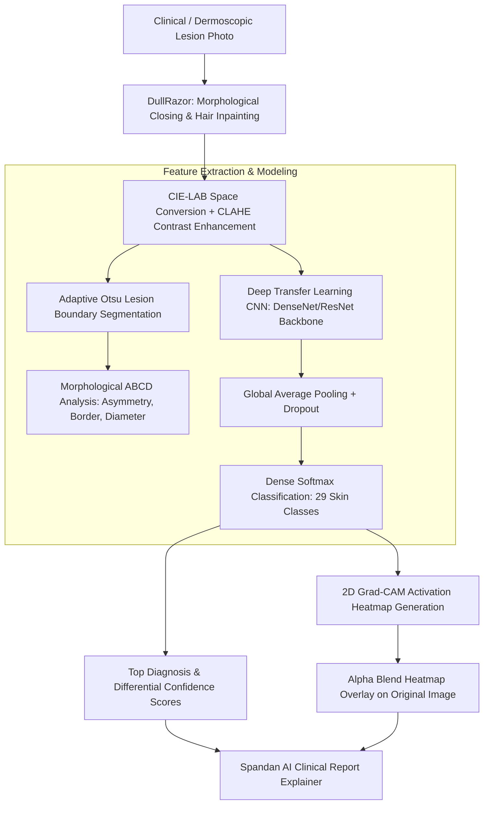

# 🔬 Spandan AI: Dermatological Skin Disease Prediction Module
## DullRazor Filtering, Morphological ABCD Segmentation & 2D Grad-CAM Overlays

---

### 1. Feature Overview & Diagnostic Value

Early detection of malignant skin neoplasms (such as Melanoma and Basal Cell Carcinoma) dramatically improves 5-year patient survival rates (from $<30\%$ for metastatic disease to $>98\%$ when identified early). However, clinical visual screening is impeded by hair artifacts, specular reflections from dermoscopic fluids, variable lighting, and overlapping morphologies between benign nevi and early-stage lesions.

The **Dermatological Skin Disease Prediction Module** implements a comprehensive diagnostic pipeline:
1. **DullRazor Morphological Hair Suppression**: Eradicates interfering body hairs and surface fibers without corrupting lesion pigment structure.
2. **CIE-LAB CLAHE Contrast Normalization**: Standardizes contrast across disparate patient skin phototypes (Fitzpatrick scale I through VI).
3. **Automated Lesion Segmentation**: Isolates the primary pathological boundary using adaptive Otsu thresholding and contour hierarchy filtering.
4. **Morphological ABCD Feature Calculation**: Quantifies clinical Asymmetry, Border Irregularity, and Diameter metrics.
5. **Hierarchical 29-Class Diagnostic Network**: Classifies conditions across 4 clinical disease groups using a **Deep Transfer Learning CNN**.
6. **2D Grad-CAM Heatmap Visualization**: Generates a jet colormap heatmap overlay showing exactly which internal pigment networks and peripheral borders triggered the neural prediction.
7. **Clinical AI Report Synthesis**: Integrates lesion risk stratification, UV defense habits, and specialist biopsy consultation guidance.



---

### 2. Clinical Image Preprocessing Pipeline

#### 2.1 DullRazor Hair Removal Algorithm
Dark, overlapping body hairs create false linear edges that mislead deep convolutional filters:
1. **Grayscale Morphological Closing**: Applies a morphological closing filter using a linear structuring element ($9 \times 9$ cross-hair kernel) to bridge narrow, dark linear structures:
   $$I_{\text{closed}} = (I \bullet B) = (I \oplus B) \ominus B$$
2. **Hair Mask Extraction**: Isolates pixels where the closed image differs significantly from the original grayscale:
   $$\text{Mask}_{\text{hair}}(x, y) = \begin{cases} 255 & \text{if } (I_{\text{closed}}(x, y) - I(x, y)) > T_{\text{hair}} \\ 0 & \text{otherwise} \end{cases}$$
3. **Adaptive Inpainting**: Replaces hair pixels with surrounding dermoscopic skin tones using bilinear interpolation (Telea fast marching method).

#### 2.2 CIE-LAB Contrast Enhancement (CLAHE)
Direct RGB equalization distorts natural skin colorimetry. Spandan AI enhances contrast purely along the luminance axis:
1. Converts the hair-suppressed BGR image into the perceptual **CIE-LAB** color space ($L^*, a^*, b^*$).
2. Applies **Contrast-Limited Adaptive Histogram Equalization (CLAHE)** with a clip limit of $2.5$ and tile grid size of $8 \times 8$ strictly to the $L^*$ (lightness) channel:
   $$L_{\text{enhanced}}^* = \text{CLAHE}(L^*)$$
3. Re-combines $L_{\text{enhanced}}^*$ with original chromatic channels $a^*$ and $b^*$ and converts back to BGR space.

---

### 3. Automated Lesion Boundary Segmentation & ABCD Morphometry

Clinical dermatologists evaluate pigmented lesions using the **ABCD criteria** (Asymmetry, Border, Color, Diameter). Spandan AI calculates these morphological metrics algorithmically:

#### 3.1 Lesion Segmentation
1. Converts the CLAHE-enhanced image to grayscale and applies mild Gaussian blurring ($\sigma = 1.5$) to remove high-frequency epidermal micro-textures.
2. Applies Otsu's optimal global binarization to separate the darker lesion core from peripheral healthy skin.
3. Performs morphological opening and selects the largest connected contour corresponding to the primary lesion.

#### 3.2 Asymmetry Index (A)
The algorithm calculates the lesion's center of mass and primary inertia axes using second-order central spatial moments:
$$\mu_{20} = \sum (x - \bar{x})^2 I(x, y), \quad \mu_{02} = \sum (y - \bar{y})^2 I(x, y), \quad \mu_{11} = \sum (x - \bar{x})(y - \bar{y}) I(x, y)$$
The lesion mask is folded along its major and minor principal axes. The Asymmetry Index ($A \in [0, 1]$) represents the non-overlapping area ratio:
$$\text{Asymmetry Index} = \frac{\text{Area}(\text{Mask} \oplus \text{FoldedMask})}{\text{Area}(\text{Mask})}$$

#### 3.3 Border Irregularity (B)
Quantifies perimeter jaggedness using the isoperimetric compactness quotient:
$$\text{Border Irregularity} = \frac{P^2}{4 \pi A_{\text{lesion}}}$$
A smooth circular mole yields a ratio near $1.0$, whereas invasive malignant lesions with notched, scalloped borders produce significantly elevated scores ($> 1.8$).

#### 3.4 Diameter Estimation (D)
Computes the minimum bounding circle diameter enclosing the segmented contour, calibrated to estimated pixel dimensions.

---

### 4. Hierarchical Disease Taxonomy (29 Dermatological Classes)

The dermatological taxonomy is organized across 4 major pathophysiological categories:

```
├── Neoplastic & Pre-Malignant (8 Classes)
│   ├── Melanoma [High Priority / Specialist Flag]
│   ├── Basal Cell Carcinoma [Specialist Flag]
│   ├── Squamous Cell Carcinoma [Specialist Flag]
│   ├── Actinic Keratosis (Pre-Malignant)
│   ├── Melanocytic Nevus (Common Mole - Baseline)
│   ├── Benign Keratosis (Seborrheic Keratosis)
│   ├── Dermatofibroma
│   └── Vascular Lesion (Hemangioma / Pyogenic Granuloma)
│
├── Inflammatory & Autoimmune (9 Classes)
│   ├── Eczema (Atopic Dermatitis)
│   ├── Psoriasis (Plaque Psoriasis)
│   ├── Contact Dermatitis
│   ├── Rosacea
│   ├── Urticaria (Hives)
│   ├── Lichen Planus [Rare / Specialist Flag]
│   ├── Seborrheic Dermatitis
│   ├── Alopecia Areata
│   └── Keloid / Hypertrophic Scar
│
├── Infectious: Viral, Bacterial, Fungal & Parasitic (9 Classes)
│   ├── Ringworm / Fungal Infection (Tinea Corporis)
│   ├── Herpes Zoster (Shingles)
│   ├── Impetigo
│   ├── Scabies [Rare / Specialist Flag]
│   ├── Cellulitis [Acute / Specialist Flag]
│   ├── Warts (HPV-related)
│   ├── Tinea Versicolor
│   ├── Molluscum Contagiosum [Rare / Specialist Flag]
│   └── Chickenpox Rash (Varicella)
│
└── Appendageal, Pigmentary & Baseline (3 Classes)
    ├── Normal / Healthy Skin (Control)
    ├── Acne (Acne Vulgaris)
    └── Vitiligo
```

#### Rare Class & Specialist Referral Routing
High-risk conditions trigger an automatic **"Flagged for Specialist Physician Review"** alert banner:
- **Melanoma**: Immediate surgical excision biopsy and dermato-oncology workup required.
- **Cellulitis**: Acute spreading bacterial dermis infection requiring prompt systemic antibiotic intervention.
- **Scabies**: Contagious parasitic infestation requiring permethrin eradication.
- **Lichen Planus**: Rare T-cell mediated autoimmune dermatosis.

---

### 5. Deep Transfer Learning CNN Architecture

The skin classification backbone utilizes a deep convolutional neural network initialized on ImageNet weights:

```
Input Image: [Batch, 224, 224, 3] (Normalized [-1, 1])
      │
      ▼
Convolutional Backbone (DenseNet-121 / ResNet-50)
Feature Maps: [Batch, 7, 7, 1024]
      │
      ▼
GlobalAveragePooling2D
      │
      ▼
BatchNormalization + Dropout (0.4)
Dense (256 units, ReLU, L2 Regularization 1e-4)
Dropout (0.3)
      │
      ▼
Dense (29 units, Softmax) ──► Output Probabilities: P(Condition_i)
```

1. **Input Normalization**: Resizes input photos to $224 \times 224$ pixels and normalizes pixel values to $[-1.0, 1.0]$.
2. **Transfer Learning Strategy**: Frozen early convolutional feature extractors capture generic visual primitives (edges, textures, color gradients), while fine-tuned terminal dense layers specialize in dermatological patterns (globular networks, pigment reticulation, branching vessels).

---

### 6. 2D Grad-CAM Explainability & Heatmap Overlay

To build clinical trust and eliminate black-box AI behavior, Spandan overlays a Grad-CAM activation heatmap directly onto the lesion photo:

1. **Neuron Importance Weights**: Computes the gradient of the predicted class score $y^c$ with respect to the feature map activations $A^k$ of the final convolutional layer:
   $$\alpha_k^c = \frac{1}{Z} \sum_{i} \sum_{j} \frac{\partial y^c}{\partial A_{i, j}^k}$$
2. **Coarse Heatmap Generation**: Takes the weighted sum followed by a ReLU non-linearity:
   $$L_{\text{Grad-CAM}}^{2D}(i, j) = \text{ReLU}\left(\sum_k \alpha_k^c A^k(i, j)\right)$$
3. **Bilinear Upsampling & Jet Colormap**: Upsamples the $7 \times 7$ grid back to the original image dimensions ($224 \times 224$) and applies an OpenCV `COLORMAP_JET` (blue $\to$ green $\to$ yellow $\to$ red).
4. **Transparent Alpha Blending**: Blends the colormap with the original lesion photograph using an opacity weight of $\alpha = 0.45$:
   $$I_{\text{overlay}} = \alpha \cdot \text{Heatmap} + (1 - \alpha) \cdot I_{\text{original}}$$

---

### 7. Interactive Frontend Toggle & Visualization (`ResultsPage.jsx`)
- **Toggle View Button**: Allows the clinician or patient to smoothly switch between the **Original Photo** and the **Grad-CAM Heatmap**.
- **Interactive Legend**: Displays a color-coded activation gradient from Low (cyan/green) to High (yellow/rose).
- **ABCD Segmentation Metrics Card**: Displays computed Asymmetry Index, Border Irregularity, and Estimated Diameter alongside differential diagnosis confidence bars.
